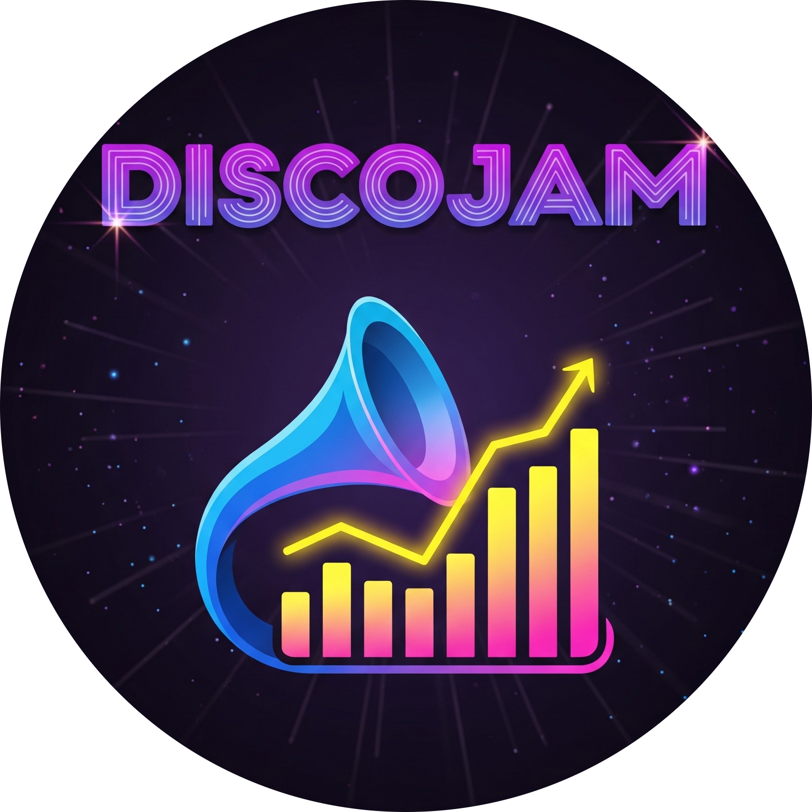

<div align="center" id="top"> 
  

  &#xa0;

  <!-- <a href="https://s2datadrivenapp.netlify.app">Demo</a> -->
</div>

<h1 align="center">S2 Data Driven App</h1>

<p align="center">
  
  
  
  

  <!--  -->

  <!--  -->

  <!--  -->
</p>

<!-- Status -->

<!-- <h4 align="center"> 
	🚧  S2 Data Driven App 🚀 Under construction...  🚧
</h4> 

<hr> -->

<p align="center">
  <a href="#About">About</a> &#xa0; | &#xa0; 
  <a href="#Features">Features</a> &#xa0; | &#xa0;
  <a href="#Technologies">Technologies</a> &#xa0; | &#xa0;
  <a href="#Requirements">Requirements</a> &#xa0; | &#xa0;
  <a href="#Starting">Starting</a> &#xa0; | &#xa0;
  <a href="#License">License</a> &#xa0; | &#xa0;
  <a href="https://github.com/LadishDev" target="_blank">Author</a>
</p>

<br>

## 🎯 About ##

This project was aimed to get me involved into interacting with an API and utilizing such data. This app is very basic and limited due to the API having lots of wrong data causing the implementation of some features impossible due to the information presented wouldnt be correct.

However, even with these issues I faced it taught me a lot about interacting with APIs and the usefulness of them that can be applied in many different scenarios. If going back to this project I would restart from scratch and use a more robust and trust worthy API for all the data and use the Qt Framework but due to the limitations of this project I used the tools that were set out for me.

## ✨ Features ##

- Homepage of the app displays songs from different categories in the top 10. Also renews songs listed after app closed and relaunched.
- Able to search songs via Song Name and Artist
- Can save found songs to your list that is stored within a document.


## 🚀 Technologies ##

The following tools were used in this project:

- [OpenFrameworks](https://openframeworks.cc/)
- [Discogs API](https://www.discogs.com/developers)

## ✔️ Requirements ##

Before starting, you need to have [Git](https://git-scm.com) & [OpenFrameworks](https://openframeworks.cc/) installed.

## 🏳️ Starting ##

```bash
# Clone this project
$ git clone https://github.com/LadishDev/s2-data-driven-app

# Access
$ cd s2-data-driven-app

# Launch App Within Visual Studio via OpenFrameworks
```

## 📝 License ##

This project is under license from MIT. For more details, see the [LICENSE](LICENSE.md) file.

&#xa0;
<a href="#top">Back to top</a>
